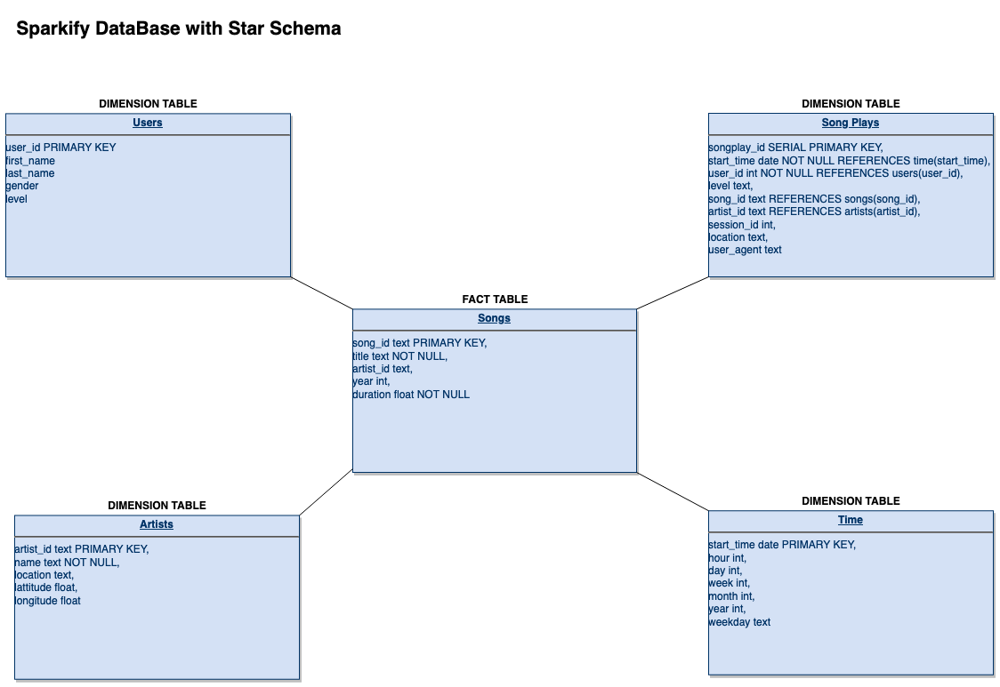

 

# Data Modeling with Postgres

<h2 align="center">Summary</h2>

A startup called Sparkify wants to analyze the data they've been collecting on songs and user activity 
on their new music streaming app. The analytics team is particularly interested in understanding what 
songs users are listening to. Currently, they don't have an easy way to query their data, which resides 
in a directory of JSON logs on user activity on the app, as well as a directory with JSON metadata on the 
songs in their app.

In this project, you'll apply what you've learned on data modeling with Postgres and build an ETL pipeline using Python. 
To complete the project, you will need to define fact and dimension tables for a star schema for a particular analytic 
focus, and write an ETL pipeline that transfers data from files in two local directories into these tables in Postgres 
using Python and SQL.

<h2 align="center">Role performed</h2>
I played the role of Data Engineer where I could create a Postgres database, since it data modeling until the ETL process. 
This database was designed to optimize queries on song play analysis.

The steps which I followed was:

    Create database schema. (DDL's are in the file called sql_queries.py)
    Create ETL pipeline

<h2 align="center">Schema for Song Play Analysis</h2>

  

<h2 align="center">Detailing files from project</h2>

### Datasets
* The first called **song_data** which are in `data/song_data/*`. This dataset is a subset of real data from the Million Song Dataset. 
  Each file is in JSON format and contains metadata about a song and the artist of that song.

* The second dataset called **log_data** which are in `data/log_data/*`. Consists of log files in JSON format generated by this event simulator based on the songs in the dataset above. 
  These simulate activity logs from a music streaming app based on specified configurations.

### [create_tables](create_tables.py)
Drops and creates your tables. You run this file to reset your tables before each time you run your ETL scripts.

### [etl.ipynb](etl.ipynb)
Jupyter Notebook is the file that reads and processes a single file from **song_data** and **log_data** and loads the data into
your tables also were util to explore, understand all processes that I need to perform.

### [etl.py](etl.py)
Code that reads and processes all files from **song_data** and **log_data** and loads the data into tables.

### [sql_queries.py](sql_queries.py)
This file contains DDL to `DROP` and `CREATE` all necessary table. Also has DML with all necessary `INSERT'S` and has `SELECT`.

### [test.ipynb](test.ipynb)
Connects to the database and picked up the first rows of each table to allow you to check the data loaded.